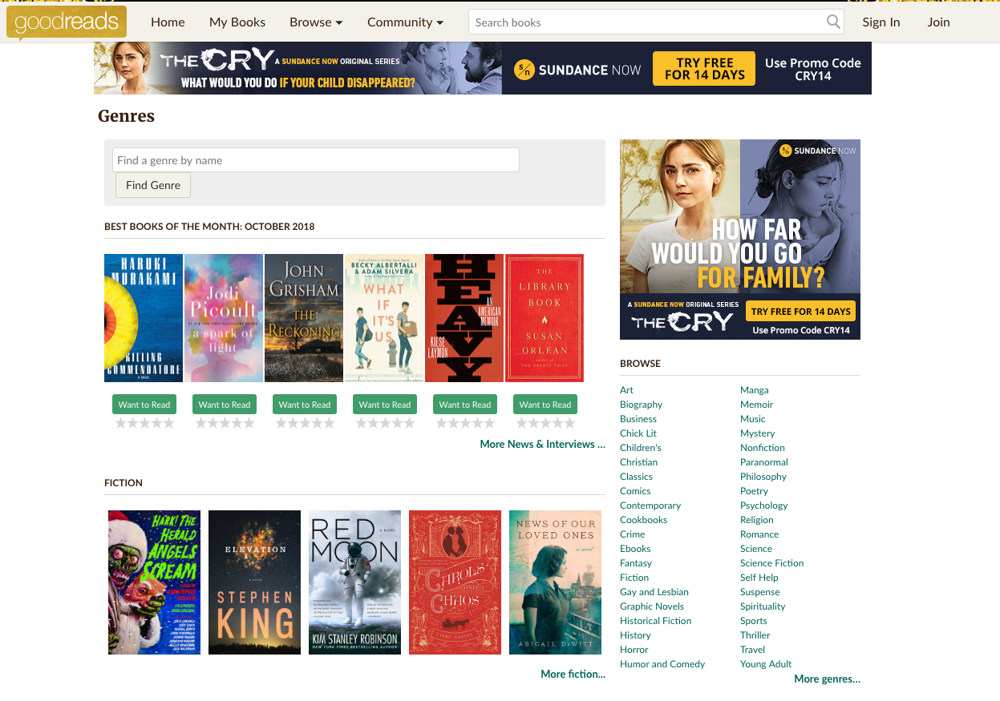

# Assignment - Book Barn Website

## Installation

- Clone this repo
- cd into `hw-react-props-book-barn`
- run `npm install` to install all of the dependencies

You are responsible to create the Book Barn website. Create React components for header, footer, main content, language etc. 

Your data will come from a JSON file which is hosted here: 

https://raw.githubusercontent.com/benoitvallon/100-best-books/master/books.json

This data is also located in the starter repo at: `src/data/bookData.js` 

**Example of Image URL**
https://raw.githubusercontent.com/benoitvallon/100-best-books/master/static/images/absalom-absalom.jpg

### Installing Bootstrap
- install bootstrap 
  - [react bootstrap](https://react-bootstrap.github.io/getting-started/introduction)

Below you can find a sample books website.

