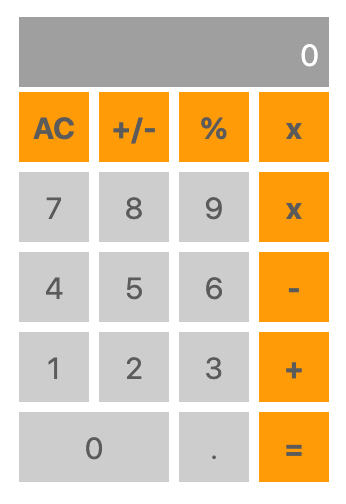

# Calculator

## Installation

- Clone this repo
- cd into `lab-react-calculator`
- run `npm install` to install all of the dependencies

## Styling
You can use pure css, flexbox or React Bootstrap.

### Installing Bootstrap
- install bootstrap 
  - [react bootstrap](https://react-bootstrap.github.io/getting-started/introduction)

Design the following calculator UI in React

